# 🤓 rreading-glasses

Corrective lenses for curmudgeonly readars in your life.

This is a drop-in replacement for R——'s metadata service. It works with your
existing R—— installation, it's backwards-compatible with your library, and it
takes only seconds to enable or disable. You can use it permanently, or
temporarily to help you add books the R—— service doesn't have yet.

Unlike R——'s proprietary service, this is much faster, handles large authors,
has full coverage of G——R—— (or Hardcover!), and doesn't take months to load
new books. A hosted instance is available at `https://api.bookinfo.pro` but it
can also be self-hosted.

```mermaid
graph LR;
    R[R——]-.->M[official metadata];
    R--> api.bookinfo.pro;

    classDef dotted stroke-dasharray:2,text-decoration:line-through;
    class M dotted;
```



> [!IMPORTANT]
> This is not an official project and is still in progress. Reach out
> to me directly if you have questions or need help, please don't bother the R——
> team.

Here's what folks have said so far:

> Already had it pull in an extra book from an author that came out in September
> that wasn't originally found!
> Will definitely be a rreading glasses evangalist! haha

> My arr instance has been switched over since yesterday, and it really has
> cleaned up that instance. I've been getting a lot of use out of it.

## Key differences

Please read this section closely before deciding to use the service, especially
if you intend to use it permanently. The service works well for my personal use
case, but there are some subtle differences that might impact you.

### Functional changes

I have deviated slightly from the official service's behavior to make a couple
of, in my opinion, quality of life improvements. These aren't due to technical
limitations and can be changed, so I'm eager to hear if people think these are
an improvement or if it would be better to match the official behavior more
exactly.

- Book titles no longer include subtitles (so `{Book Title}` behaves like
  `{Book TitleNoSub}` by default). This de-clutters the UI, cleans up the
  directory layout, and improves import matching but __you may need to
  re-import some works with long subtitles__. I think the trade-off is worth it
  but others might disagree — let me know!

- __Adding a new author now only adds (up to) 20 of their works instead of
  their entire library__. Originally this didn't automatically add _any_ works
  for new authors, because I personally much prefer a "book-based" workflow
  over the default "author-based" behavior. I figure adding 20 works is a sort
  of compromise between the two. Tell me if you really need the default (add
  all books) behavior, or if you would prefer to keep it entirely book-based!
  #17

- The "best" edition is always preferred. This makes cover art much more
  consistently high-quality, and it disables R——'s automatic edition selection
  (which tends to get even the language wrong!).

### Not implemented yet

- __Translated works aren't handled well at the moment__. If you have a lot of
  these in your collection they might be updated to reflect the English
  edition, which you might not want. This is in progress but it will need some
  time and testing. #15

## Usage

> [!CAUTION]
> This **will** modify your library. __Please__ back up your database _and
> confirm you know how to restore it_ before experimenting with this.

Navigate to `/settings/development` and update `Metadata Provider Source` with
the address of your desired metadata service (a public instance is available at
`https://api.bookinfo.pro`). Click `Save`. (This page isn't shown in the UI, so
you'll need to manually enter the URL.)


You can now search and add authors or works not available on the official
service.

If at any point you want to revert to the official service, simply delete the
`Metadata Provider Source` and save your configuration again. Any works you
added should be preserved.

> [!IMPORTANT]
> Metadata is periodically refreshed and in some cases existing files may
> become unmapped (see note above about subtitles). You can correct this from
> `Library > Unmapped Files`, or do a `Manual Import` from an author's page.

### Before / After


### Self-hosting

An image is available at
[`blampe/rreading-glasses`](https://hub.docker.com/r/blampe/rreading-glasses).
It requires a Postgres backend, and its flags currently look like this:

```
Usage: rreading-glasses serve --upstream=STRING [flags]

Run an HTTP server.

Flags:
  -h, --help                                    Show context-sensitive help.

      --postgres-host="localhost"               Postgres host.
      --postgres-user="postgres"                Postgres user.
      --postgres-password=""                    Postgres password.
      --postgres-port=5432                      Postgres port.
      --postgres-database="rreading-glasses"    Postgres database to use.
      --verbose                                 increase log verbosity
      --port=8788                               Port to serve traffic on.
      --rpm=60                                  Maximum upstream requests per minute.
      --cookie=STRING                           Cookie to use for upstream HTTP requests.
      --proxy=""                                HTTP proxy URL to use for upstream requests.
      --upstream=STRING                         Upstream host (e.g. www.example.com).
```

A `docker-compose.yml` file is included as a reference. It's highly recommended
that you include a cookie for better performance, otherwise new author lookups
will be throttled to 1 per minute.

Resource requirements are minimal; a Raspberry Pi should suffice. Storage
requirements will vary depending on the size of your library, but in most cases
shouldn't exceed a few gigabytes for personal use. (The published image doesn't
require any large data dumps and will gradually grow your database as it's
queried over time.)

## Details

This project implements an API-compatible, coalescing read-through cache for
consumption by the R—— metadata client. It is not a fork of any prior work.

The service is pluggable and can serve metadata from any number of sources: API
clients, data dumps, OpenLibrary proxies, scrapers, or other means. The
interface to implement is:

```go
type Getter interface {
    GetWork(ctx context.Context, workID int64) (*WorkResource, error)
    GetAuthor(ctx context.Context, authorID int64) (*AuthorResource, error)
    GetBook(ctx context.Context, bookID int64) (*WorkResource, error)
}
```

In other words, anything that understands how to map a G——R—— ID to a Resource
can serve as a source of truth. This project then provides caching and API
routes to make that source compatible with R——.

There are currently two sources available: [Hardcover](https://hardcover.app)
and G——R——. The former is implemented in this repo but the latter is
closed-source (for now). A summary of their differences is below.

|                   | G——R——                                                                                                                                      | Hardcover                                                                                                                                                                                                                       |
| --                | --                                                                                                                                          | -------------                                                                                                                                                                                                                   |
| Summary           | A faster but closed-source provider which makes all of G——R—— available, including large authors and books not available by default in R——. | A slower but open-source provider which makes _most_ of Hardcover's library available, as long as their metadata includes a G——R—— ID. This is a smaller data set, but it might be preferable due to having fewer "junk" books. |
| New releases?     | Supported.                                                                                                                                  | Supported.                                                                                                                                                                                                                      |
| Large authors?    | Supported.                                                                                                                                  | Supported.                                                                                                                                                                                                                      |
| Source code       | Private.                                                                                                                                    | Public.                                                                                                                                                                                                                         |
| Performance       | Very fast.                                                                                                                                  | Slower, limitted to 1RPS.                                                                                                                                                                                                       |
| Hosted instance   | `http://api.bookinfo.pro`                                                                                                                   | Coming soon!                                                                                                                                                                                                                    |
| Self-hosted image | `blampe/rreading-glasses:latest`                                                                                                            | `blampe/rreading-glasses:hardcover`                                                                                                                                                                                             |

Please consider [supporting](https://hardcover.app/pricing) Hardcover if you
use them as your source. It's $5/month and the work they are doing to break
down the G——R—— monopoly is commendable.

## Contributing

This is primarily a personal project that fixes my own workflows. There are
almost certainly edge cases I haven't accounted for, so contributions are very
welcome!

### TODO

- [ ] (Prod) Add Cloudflare client for CDN invalidation.
- [ ] (QOL) Ignore works/editions without publisher to cut down on
      self-published ebook slop.
- [ ] (QOL) Update R—— client to send `Accept-Encoding: gzip` headers.

## Disclaimer

This software is provided "as is", without warranty of any kind, express or
implied, including but not limited to the warranties of merchantability,
fitness for a particular purpose and noninfringement.

In no event shall the authors or copyright holders be liable for any claim,
damages or other liability, whether in an action of contract, tort or
otherwise, arising from, out of or in connection with the software or the use
or other dealings in the software.

This software is intended for educational and informational purposes only. It
is not intended to, and does not, constitute legal, financial, or professional
advice of any kind. The user of this software assumes all responsibility for
its use or misuse.

The user is free to use, modify, and distribute the software for any purpose,
subject to the above disclaimers and conditions.
